<div align="center">


# NexFlow

**把手機變聰明的開源自動化 App** — 用「**當…（WHEN）→ 就…（THEN）**」組合出屬於你的自動化流程。
類似 MacroDroid / Tasker，但完全開源、介面以 Material 3 重新打造。

[](https://www.android.com)
-blue)
[](https://kotlinlang.org)
[](https://developer.android.com/jetpack/compose)
[](#授權)

</div>

---

## 📸 畫面預覽

| 我的流程 | 流程編輯（WHEN → THEN） | 動作選擇 |
|:---:|:---:|:---:|
| 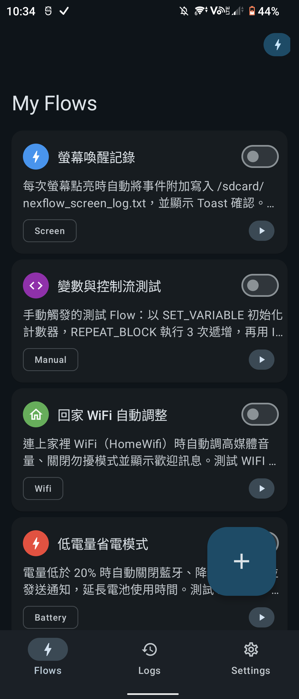 | 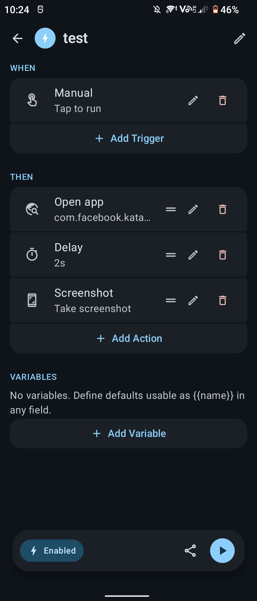 | 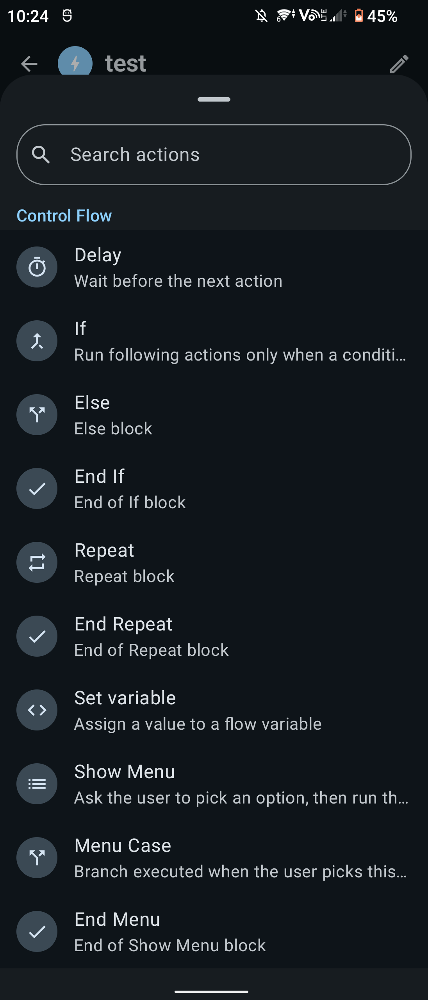 |
| 一覽所有流程，一鍵開關／執行 | 組合觸發條件與動作 | 16 種觸發 × 34 種動作，分類搜尋 |

| 執行記錄 | 權限引導 |
|:---:|:---:|
| 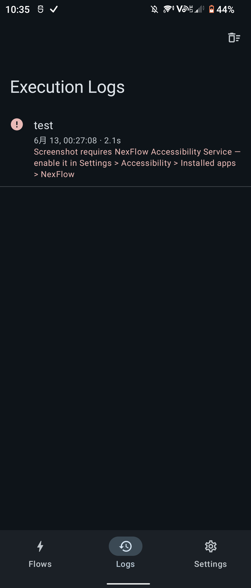 | 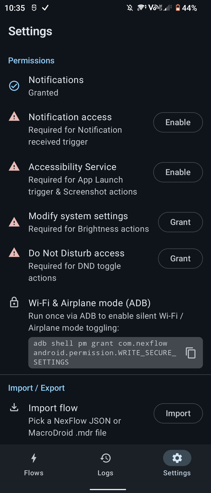 |
| 每次執行的成功／失敗與清楚的錯誤原因 | 各功能所需權限逐項引導開啟 |

## ✨ 它能做什麼？

- 🔋 **電量低於 20% 就自動開省電模式、關藍牙**
- 🏠 **回到家連上 Wi-Fi 就把音量調回、開勿擾**
- 🌙 **晚上 11 點自動截圖記帳通知、傳到你的伺服器**
- 📷 **NFC 標籤一刷就開特定 App + 朗讀今日行程**

只要想得到「**什麼情況下 → 做什麼事**」，幾乎都能組出來，還支援**變數、條件分支（If/Else）、迴圈（Repeat）**，以及匯入 MacroDroid 的 `.mdr` / `.macro` 檔。

> ✨ **不想手動組？** 內建 **Gemini AI 助手**：用文字或語音描述需求（例如「插上耳機時把音量調到 80% 並打開 Spotify」），AI 就會產生對應流程讓你檢視、儲存。需自備 Google AI Studio 的 Gemini API 金鑰，見 [AI 助手](#-ai-助手gemini)。

---

## 📥 下載與安裝

NexFlow **主要以 GitHub Release 發佈**（`github` 版），功能完整、且是可直接安裝的 APK。

> ℹ️ 本專案有 GitHub（完整）與 Google Play（依政策閹割）兩個版本。**若 Play 版未能上架，GitHub 版就是完整且唯一的官方發佈管道** — 一般使用者請直接用它。

**安裝步驟：**

1. 到本專案的 [**Releases**](https://github.com/ADSFAaron/NexFlow/releases) 頁面，下載最新版的 `app-github-release.apk`
2. **先驗證檔案**（見下方「安全性驗證」），確認雜湊值一致再安裝
3. 用檔案管理器點開 APK；Android 會提示「允許來自此來源安裝」→ 開啟該權限後即可安裝
4. 首次啟動後，依 App 內「設定」分頁的指引，逐項開啟各功能所需權限

### 🔐 安全性驗證（強烈建議）

Sideload 的 APK 不經商店掃描，**請務必核對官方公佈的 SHA-256 雜湊值**，確認下載到的檔案沒有被竄改或掉包。每個 Release 說明都會附上雜湊值。

```bash
# macOS / Linux
shasum -a 256 app-github-release.apk

# Windows (PowerShell)
Get-FileHash app-github-release.apk -Algorithm SHA256
```

把輸出的雜湊值與 Release 頁面公佈的比對，**完全一致**才安裝。

進一步（選用）：核對 APK 的**簽章憑證指紋**，確認是本專案的金鑰所簽，而非他人重打包：

```bash
apksigner verify --print-certs app-github-release.apk | grep -i "SHA-256"
```

該指紋應與 Release 說明公佈的憑證指紋相符。

---

## 功能總覽

### 觸發條件（Trigger，16 種）

| 類別 | 觸發條件 |
|------|----------|
| 時間 | 指定時間（每天／平日／週末／自訂星期／單次） |
| 裝置狀態 | 電量高低（含充電狀態）、螢幕開關／解鎖、開機、耳機插拔、**搖晃**、**環境光線** |
| 連線 | Wi-Fi 連線／斷線（可指定 SSID）、藍牙裝置連線／斷線 |
| 通訊 | 來電（可指定聯絡人）、收到簡訊（可指定發信人）、收到通知（可指定 App） |
| 其他 | App 啟動、NFC 標籤掃描、地理圍欄（進入／離開）、手動執行 |

### 動作（Action，34 種）

| 類別 | 動作 |
|------|------|
| 通知與提示 | Toast、系統通知、TTS 朗讀 |
| 裝置控制 | Wi-Fi、藍牙、勿擾模式、飛航模式、音量、亮度、媒體播放控制、截圖、更換桌布、**模擬點擊／長按**、**模擬滑動**、**擴音** |
| 通訊 | 撥打電話、傳送簡訊 |
| 網路與資料 | HTTP 請求、開啟網址、剪貼簿、寫入檔案、分享 |
| App | 開啟 App、**啟動 App 捷徑**（其他 App 的 manifest 捷徑／建立捷徑活動） |
| 流程控制 | 延遲、If／Else／End If、Repeat／End Repeat、設定變數、Show Menu／選項／End Menu |

> 🔋 **搖晃**觸發會在流程啟用期間持續監聽加速度感應器，耗電略增（環境光線觸發為事件式，幾乎不耗電）。
> 🖐️ **模擬點擊／滑動**需無障礙服務且僅在 `github` 版提供（依平台政策，`play` 版移除）。**擴音**為盡力而為，通話中的音訊路由最終由裝置廠商決定。
> 📌 流程可從詳細頁「新增到主畫面」**釘選成桌面捷徑**，點一下就手動執行（需啟動器支援釘選捷徑）。

#### 🖐️ 模擬點擊／滑動：不用自己查座標

模擬觸控要填的是**螢幕像素座標**，對一般使用者太不友善。所以這兩個動作的設定畫面都有「**從截圖選取座標**」：

1. 用系統截圖（電源鍵＋音量下鍵）拍下目標畫面
2. 在 NexFlow 裡選那張截圖
3. **直接點圖上的位置**就填好座標；滑動則點兩下（起點、終點），畫面會即時畫出路徑

點擊位置是以**佔圖片的比例**換算成實體座標，所以截圖存檔解析度和螢幕不同也不會跑掉；選到被裁切過的圖（長寬比對不上）會直接跳警告，而不是給你一組看起來合理但錯的座標。

> ℹ️ Android 沒有開放任何 API 讓第三方 App 記錄使用者在**其他 App** 上的觸控（`ACTION_OUTSIDE` 的座標自 Android 12 起已被歸零），所以無法做「錄影自動轉成座標」；截圖選點是不需 root、不需 ADB 的最佳做法。
> 點擊的「按住時間」拉長就是**長按**；滑動的「滑動時間」就是 App 感受到的速度（短＝快速滑動，長＝緩慢拖曳，例如拖進度條）。

### 🤖 AI 助手（Gemini）

用自然語言（文字或語音）描述需求，Gemini 透過 function calling 產生完整流程草稿：

- **自備金鑰**：需在 Google AI Studio 取得免費 Gemini API 金鑰，於「設定 → AI」填入。金鑰只存本機、排除雲端備份，也不會寫入 log
- **對話式建立**：AI 會先追問釐清、呼叫「搜尋已安裝 App」工具解析套件名，再產生流程；產生前於畫面即時顯示執行進度
- **語音輸入**：可用系統語音辨識口述需求，聆聽時輸入框有 Gemini 風格漸層動效
- **可繼續修改**：同一對話中可要求微調，直接更新同一個流程；也可開新對話
- 🔒 AI 產生的流程一律**停用**加入，須經檢視、授權才能啟用（與匯入相同的安全閘門）；話題僅限自動化，無關內容會被婉拒

> 💡 **通訊類（簡訊／撥號）僅在 `github` 版提供**。Google Play 版（`play` flavor）依平台政策移除這些功能與權限，見[建置](#建置)。

### 變數與條件式

Flow 可宣告變數（含預設值），在任何欄位用 `{{變數名}}` 引用；`SET_VARIABLE` 動作可在執行中改變其值。

還支援 **全域變數（跨 Flow 共用）**：在「設定 → 全域變數」建立，任何流程都能以 `{{g:名稱}}` 引用；用名為 `g:名稱` 的 `SET_VARIABLE` 寫入後，值會**持久保存**並被其他流程讀到（例如跨流程的計數器、狀態旗標）。變數選單會**用顏色與圖示區分**全域（🌐 `全域` 標籤）與區域變數。

<div align="center">

| 全域變數管理 | 設定變數（可挑區域／全域） |
|:---:|:---:|
| 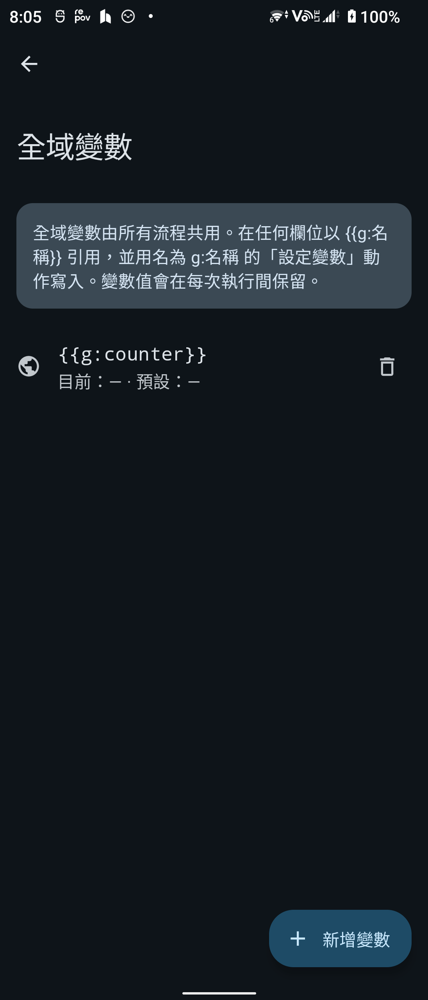 | 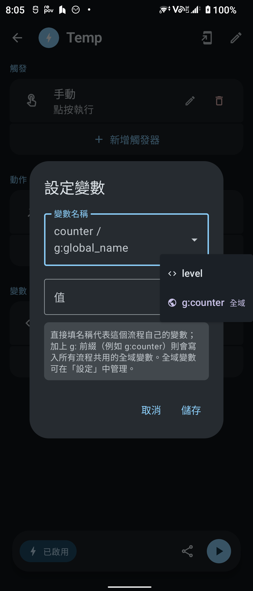 |
| 「設定 → 全域變數」建立、跨流程共用 | 下拉挑現有變數，全域以 🌐 標色 |

</div>

**不必手打變數名稱** — 為了避免打錯字造成流程靜默失效，變數的引用與條件式都改成「用點選的」：

| 改善項目 | 說明 |
|----------|------|
| 🔘 **插入變數選單** | 每個文字欄位右側有一個 `{ }` 按鈕，點開就列出目前流程所有變數，選了直接插入游標處（不再是接在字尾），完全不用手打名字 |
| 🧩 **條件式產生器** | `IF_BLOCK` 不再是一格自由文字，而是「**值 A → 運算子 → 值 B**」三格：值可從變數選單挑、運算子用下拉選（`==`／`!=`／`<`／`<=`／`>`／`>=`），存檔時自動組回運算式 |
| ⚠️ **未知變數警示** | 設定框只要偵測到 `{{名字}}` 不在此流程的變數清單中（打錯字、改名、舊匯入殘留），就會即時跳出紅色提示，並且**停用「儲存」鍵**，打錯的名字根本存不進流程 |
| 🌐 **未建立的全域變數** | `SET_VARIABLE` 的名稱欄位填了不存在的 `g:名稱` 時同樣標紅、擋下儲存（這種名字沒有 `{{ }}`，上面那條掃不到）；真的漏進來（匯入的舊檔）則執行時直接失敗，並在執行記錄寫出是哪個名字 |

<div align="center">

| 條件式產生器 | 插入變數選單 | 未知變數警示 |
|:---:|:---:|:---:|
| 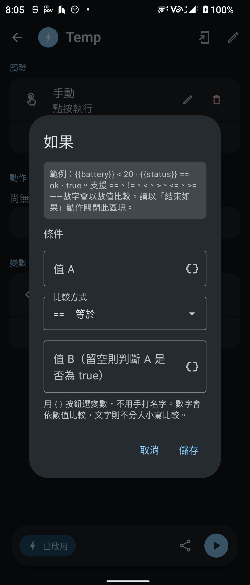 | 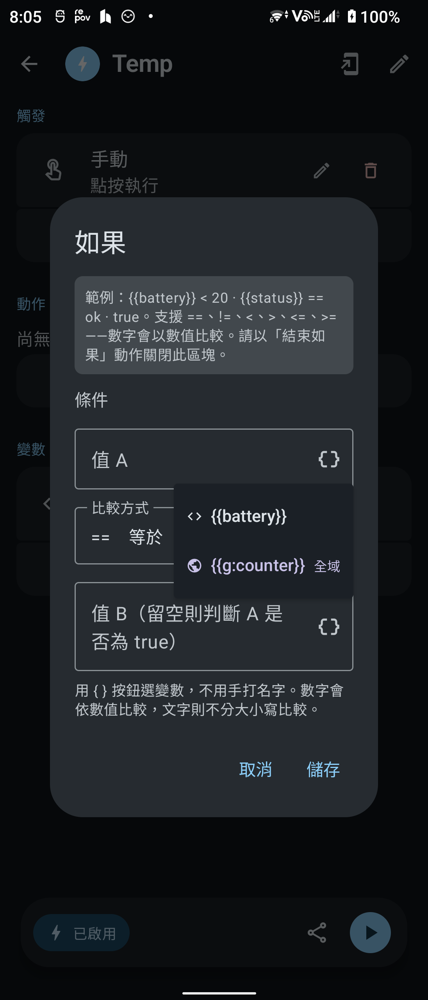 | 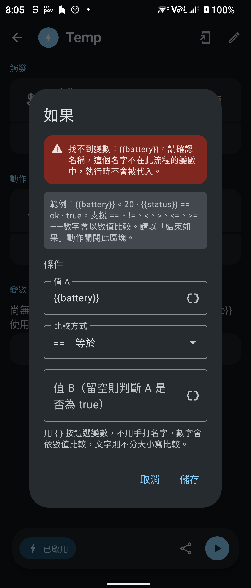 |
| 三格點選、免手打運算式 | `{ }` 按鈕列出流程變數 | 偵測到打錯的 `{{name}}` 即時警示 |

</div>

條件式產生器把使用者輸入組成 interpreter 看得懂的運算式，過程零手打：

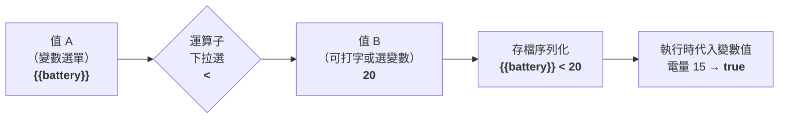

> 數值兩側皆為數字時做數值比較，否則不分大小寫字串比較。**值 B 留空**則直接判斷「值 A 是否為 true」。運算式格式與儲存不變，舊流程開啟後仍能正確解析與往返（round-trip）。

### 匯入／匯出

- 自有格式：`.flow`（JSON），規格見 [docs/FLOW_SCHEMA.md](docs/FLOW_SCHEMA.md)
- MacroDroid 相容：可解析並轉換 `.mdr`（整份備份）與 `.macro`（單一巨集分享）匯出檔，連同設定欄位一起轉換（`core/macrodroid-compat`，格式與對照依據見 [docs/MACRODROID_IMPORT.md](docs/MACRODROID_IMPORT.md)）
- 支援檔案選擇器匯入、系統分享（Share）匯入、Flow 詳細頁直接匯出分享
- 🌐 匯出的 `.flow` 會一併帶上該流程用到的**全域變數宣告**（名稱／型別／預設值），匯入時自動補建缺少的變數 —— 換裝置後 `{{g:名稱}}` 仍可用。只帶宣告不帶當下的值（計數器跑到一半的值換台手機沒有意義），已存在的同名變數不會被覆寫
- 🔒 匯入的流程一律以**停用**狀態加入，外部分享的檔案會先跳確認框，避免惡意檔案自動執行

---

## 技術棧

| 項目 | 版本 |
|------|------|
| Kotlin | 2.4.10（KSP 2.3.11，無 kapt） |
| AGP / Gradle | 9.3.1 / 9.7.0 |
| UI | Jetpack Compose（BOM 2026.08.00）+ Material 3 1.5.0-alpha26（含 Expressive API） |
| DI | Hilt 2.60.1 |
| 資料庫 | Room 2.8.4 |
| 網路 | Ktor 3.5.2、kotlinx.serialization 1.11.0 |
| 其他 | Navigation Compose 2.9.8、WorkManager 2.11.2、Glance 1.1.1（桌面小工具）、Coil 3.5.0、play-services-location 21.4.0（地理圍欄） |
| 測試 | JUnit 5.14.4、Robolectric 4.16.1、MockK 1.14.11、Turbine 1.2.1、Compose Preview 截圖測試 |
| SDK | minSdk 30（Android 11）／ targetSdk 37 |

## Module 結構

```
app/                        # Android App：UI、Room、Hilt、trigger/executor 實作、Service
core/automation/            # 純 Kotlin JVM：領域模型、FlowInterpreter（IF/REPEAT/變數）、repository 介面
core/flow-schema/           # 純 Kotlin JVM：.flow JSON 序列化與驗證
core/macrodroid-compat/     # 純 Kotlin JVM：MacroDroid .mdr 解析與轉換
```

### 架構重點

- **Trigger 系統**：`TriggerHandler` 介面 + Hilt multibinding（`@Binds @IntoSet`，註冊於 `app/.../di/ExecutionModule.kt`）。Android 元件（AccessibilityService、NotificationListener、BroadcastReceiver…）透過 singleton EventSource（`MutableSharedFlow`）橋接到 handler
- **Action 系統**：`ActionExecutor` 介面 + 同樣的 multibinding。控制流程動作（IF/REPEAT/SET_VARIABLE）由 `FlowInterpreter` 直接處理，不需要 executor
- **執行引擎**：`FlowEngine` 觀察啟用中的 Flow，把每個 (flow, trigger) 配對成事件串流，觸發時交給 `FlowInterpreter` 執行並寫入執行記錄
- **新增型別時**：在 `TriggerType`/`ActionType` 加 enum → 實作 handler/executor → `ExecutionModule` 加綁定 → `TriggerConfig`/`ActionConfig` 加 UI 欄位定義。少做任何一步都會被自動化測試抓到（見[測試](#測試)）

## 建置

```bash
git clone <repo>
cd StudioProject
```

專案有兩個 **product flavor**：

| Flavor | 用途 | 簡訊／撥號 | 模擬點擊／滑動 | 產物 |
|--------|------|:---:|:---:|------|
| **`github`** | sideload / GitHub Release，**功能完整** | ✅ | ✅ | APK（可直接安裝） |
| `play` | 上架 Google Play（依政策移除簡訊／撥號權限與程式碼；模擬點擊／滑動也一併移除） | ❌ | ❌ | AAB（上架用） |

> 👉 **一般使用者請下載 `github` 版**：功能最完整、且是可直接安裝的 APK。Play 版是為了符合商店政策而閹割的版本，若未能上架，`github` 版就是唯一且完整的發佈管道。

```bash
./gradlew :app:assembleGithubDebug     # 完整版 debug APK（開發用，debug 簽章）
./gradlew :app:assembleGithubRelease   # 完整版 release APK（發佈給使用者 sideload）★
./gradlew :app:bundleGithubRelease     # 完整版 release AAB
./gradlew :app:bundlePlayRelease       # Play 版 release AAB（上架用）
```

產物路徑：

| 指令 | 輸出檔 |
|------|--------|
| `assembleGithubRelease` | `app/build/outputs/apk/github/release/app-github-release.apk` |
| `bundleGithubRelease` | `app/build/outputs/bundle/githubRelease/app-github-release.aab` |

> 💡 **APK vs AAB**：發佈到 GitHub Release 給使用者直接安裝請用 **APK**（`assembleGithubRelease`）。AAB 無法直接安裝，是給 Google Play 拆分下載用的格式（本機要裝 AAB 得再透過 `bundletool`）。

需求：JDK 17+（Gradle toolchain 會自動處理 module 的 JVM 11 目標）、Android SDK Platform 37。

### Release 簽章

Release 版需要一份**上簽章金鑰（keystore）**，設定放在 `app/keystore.properties`（已被 `.gitignore` 排除，不進 repo）：

```properties
storeFile=/absolute/path/to/upload-keystore.jks
storePassword=********
keyAlias=upload
keyPassword=********
```

沒有這個檔案時，release 任務仍可 configure，但會產出**未簽章**的 APK（無法安裝）。第一次要先產生金鑰：

```bash
keytool -genkey -v -keystore upload-keystore.jks \
  -alias upload -keyalg RSA -keysize 2048 -validity 10000
```

> ⚠️ **金鑰要離線保管、不可外流也不可弄丟**：同一 App（`com.adsf.nexflow`）未來的更新必須用**同一把金鑰**簽章，否則使用者無法直接覆蓋升級。

### 發佈與檔案校驗（SHA-256）

為了讓使用者能確認下載到的 APK 沒有被竄改，**每次發佈都應附上校驗值**，並寫進 GitHub Release 說明：

```bash
APK=app/build/outputs/apk/github/release/app-github-release.apk

# 1) 檔案雜湊（SHA-256）— 貼進 Release 說明
shasum -a 256 "$APK"

# 2) 簽章憑證指紋 — 證明「這顆 APK 是本專案金鑰簽的」
apksigner verify --print-certs "$APK" | grep -i "SHA-256"
```

建議在每個 Release 附上一個 `SHA256SUMS.txt`：

```bash
shasum -a 256 "$APK" > SHA256SUMS.txt
```

## 測試

### JVM 單元測試（不需裝置）

```bash
./gradlew :core:automation:test            # FlowInterpreter：條件式、IF/ELSE、REPEAT、變數
./gradlew :app:testGithubDebugUnitTest     # 設定 UI 的全型別覆蓋與 interpreter key 契約
```

> 因為有 flavor，單元測試任務需帶 flavor 名：`testGithubDebugUnitTest` 或 `testPlayDebugUnitTest`。

涵蓋內容：

- `FlowInterpreterTest` — 條件式求值（比較運算子、數值/字串）、IF/ELSE 分支、REPEAT 次數、SET_VARIABLE 新舊 key 相容
- `TriggerConfigTest` / `ActionConfigTest` — **每一種** TriggerType（16）與 ActionType（34）的 picker 資訊、欄位 key 唯一性、空設定與填滿設定的摘要產生，以及與 interpreter 的 key 契約（IF 的 `expression`、REPEAT 的 `count`、SET_VARIABLE 的 `variable_name`/`value`）

### 裝置 instrumented 測試（需要實機或模擬器）

**執行前必須先關閉系統動畫**，否則 Compose 文字輸入測試會因 Espresso 等不到 main looper idle 而逾時：

```bash
adb shell settings put global window_animation_scale 0
adb shell settings put global transition_animation_scale 0
adb shell settings put global animator_duration_scale 0
```

執行（同樣需帶 flavor）：

```bash
./gradlew :app:connectedGithubDebugAndroidTest
```

涵蓋內容：

- `ExecutionBindingsTest` — 從真實 Hilt graph 驗證每個 TriggerType 都有 TriggerHandler、每個可執行 ActionType 都有 ActionExecutor 且無重複綁定（flavor 隱藏的型別會自動排除），抓「忘了在 ExecutionModule 註冊」這類只會在執行期爆炸的錯
- `ConfigDialogRenderTest` — 在裝置上實際 render 全部 trigger/action 的設定對話框，驗證每個欄位元件都有顯示，並測試輸入值能正確存進 config

instrumented 測試使用 `com.nexflow.HiltTestRunner`（HiltTestApplication）；新增 Hilt 相關測試標上 `@HiltAndroidTest` 即可。

測完可還原動畫：

```bash
adb shell settings put global window_animation_scale 1.0
adb shell settings put global transition_animation_scale 1.0
adb shell settings put global animator_duration_scale 1.0
```

## 權限說明

部分功能需要使用者手動授權（App 的 Settings 分頁有逐項引導）：

| 功能 | 需要的權限 |
|------|-----------|
| App 啟動觸發、截圖動作、模擬點擊／滑動 | 無障礙服務（Accessibility Service） |
| 通知觸發 | 通知存取權限（Notification Listener） |
| 地理圍欄 | 精確定位 + 背景定位 |
| 亮度調整 | 修改系統設定（WRITE_SETTINGS） |
| 勿擾模式 | 勿擾存取權限 |
| Wi-Fi／飛航模式靜默切換 | `WRITE_SECURE_SETTINGS`（需透過 ADB 授權一次，App 內有指令可複製） |
| NFC 觸發 | App 開著時皆可；關著時僅限 NDEF 標籤，且需有啟用中的 NFC 流程 |

## 已知限制（規劃中）

- 全域變數需先在「設定 → 全域變數」建立才能寫入：`SET_VARIABLE` 不會用打錯的 `g:名稱` 自動建立新變數（避免 typo 悄悄產生殭屍變數）。設定框會擋下不存在的 `g:` 名稱、無法儲存；萬一仍寫入（例如匯入的舊檔），執行會**失敗並在執行記錄寫出該名稱**，而不是靜默跳過
- **MacroDroid 相容為部分覆蓋**：目前對照 22 種觸發、30 種動作、7 種條件的 MacroDroid class type（MacroDroid 本身有上百種），其餘一律轉成 `UNSUPPORTED` 並在匯入時逐項列出警告（原始 class 名會保留在 config 裡，方便手動補上對應動作）。設定欄位有 46 種 class 的對照，沒有對照或對不過去的欄位同樣會逐項寫進警告，不會靜默消失。轉換是 best-effort，複雜巨集匯入後請先檢視再啟用 —— 已知一定轉不過來的項目（地理圍欄座標、選單各選項的動作、捷徑、桌布圖片…）列在 [docs/MACRODROID_IMPORT.md](docs/MACRODROID_IMPORT.md)
- **精確時間需要「鬧鐘與提醒」權限**：TIME 觸發走 `AlarmManager`，Android 12+ 未授權 `SCHEDULE_EXACT_ALARM` 時會退回不精確排程 —— 仍能穿透 Doze，但系統可能併入維護視窗，**誤差可達一小時**（官方對不精確鬧鐘的保證是「一小時內」）。未授權時**流程卡片會亮出警告**並帶你前往授權，授權後既有排程會立即重新校正
- **省電機制可能中斷非時間類觸發**：搖晃、環境光、Wi-Fi／藍牙、耳機、螢幕等觸發依附於前景服務的事件串流，被系統或廠商的省電策略殺掉後就會停止監聽（TIME 因為由 AlarmManager 驅動不受影響）。目前**還沒有引導使用者把 App 加入電池最佳化白名單**的畫面，激進省電的機型請自行到系統設定放行
- **同一流程不會並行執行**：正在執行的流程再次被觸發會直接略過（避免重複觸發疊加成多份同時執行），這些觸發**不會排隊補跑**
- **Wi-Fi／飛航模式靜默切換需一次性 ADB 授權**：Android 10 起系統不再開放第三方 App 直接切換，必須手動授予 `WRITE_SECURE_SETTINGS`（App 內可複製指令）；未授權時只能改為跳轉系統設定頁
- **NFC 背景觸發只涵蓋 NDEF 標籤**：App 開著時走 `enableReaderMode`，什麼標籤都讀得到。關著時走 `TECH_DISCOVERED`，tech-list 只列 `Ndef`／`NdefFormatable` —— 交通卡、門禁卡（MifareClassic）與感應支付（IsoDep）不會列舉 `Ndef`，所以**背景不會觸發**，這是刻意的：那份攔截若放寬，NexFlow 就會變成這些卡片的萬用接收者。另外，**寫入網址的標籤仍會開啟瀏覽器**（`NDEF_DISCOVERED` 優先權在上）。背景攔截掛在預設關閉的 `<activity-alias>` 上，只有在你有啟用中的 NFC 流程時才會打開——沒有的話 NexFlow 完全不出現在標籤分派名單裡

## 參與貢獻

歡迎回報問題、提功能建議，或直接送 PR（新增觸發／動作、補翻譯、擴充 MacroDroid 相容都很受歡迎）：

- 💬 [**Discussions**](https://github.com/ADSFAaron/NexFlow/discussions) — 使用問題、流程分享、還沒想清楚的點子都在這裡聊
- 📋 [**CONTRIBUTING.md**](CONTRIBUTING.md) — 開發環境、flavor 與測試指令、**新增 Trigger／Action 的四個必要步驟**
- 🤝 [**CODE_OF_CONDUCT.md**](CODE_OF_CONDUCT.md) — 社群行為準則（Contributor Covenant 2.1）
- 🔐 [**SECURITY.md**](SECURITY.md) — 安全性漏洞請**私下回報**，不要開公開 issue

## 授權

本專案採用 [Apache License 2.0](LICENSE) 授權，Copyright 2026 ADSFAaron and the NexFlow contributors。
送出貢獻即表示同意以相同授權釋出。
